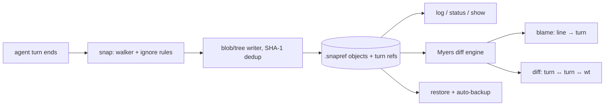

# snapref

[English](README.md) | [中文](README.zh.md) | [日本語](README.ja.md)

[](LICENSE) [](Cargo.toml)  [](CONTRIBUTING.md)

**AI エージェントセッションのためのオープンソースなシャドウ git スナップショット——毎ターン作業ツリーを記録し、どの行もそれを書いたターンへ blame でき、どの状態へも復元できる。**


```bash
git clone https://github.com/JaydenCJ/snapref.git && cargo install --path snapref
```

## なぜ snapref？

エージェントセッションが 40 ターンも進むと、「このファイルはどのターンで壊れた？」に良い答えはなくなる。テレメトリ再生ツールが再構築するのは span とツール呼び出しであり、ディスク上のバイト列ではない。毎ターン commit する手もあるが、後で squash する羽目になるノイズで本物の git 履歴が溢れる。IDE のローカル履歴はファイル単位・エディタ縛りで、ツリー全体の状態は復元できない。snapref は git の核心——内容アドレス方式のスナップショット——をシャドウストア（`.snapref/`）に移し、本物のリポジトリには一切触れない。ラッパーが各ターン終了時に `snapref snap` を呼べば、以後 `blame` が各行の背後のターンを言い当て、`diff` が任意の 2 ターン（または作業ツリー）を比較し、`restore` がツリー全体を巻き戻す——削除されたファイルは蘇り、未コミットの変更は 1 バイトも上書きされる前に独立したバックアップターンとして保存される。std のみに依存する単一の Rust バイナリで、オフライン・決定的・テレメトリ無しだ。

|  | snapref | 毎ターン git commit | IDE ローカル履歴 | テレメトリ再生 |
|---|---|---|---|---|
| 追跡対象 | 作業ツリーのバイト列 | ステージ内容 | エディタバッファ | span / ツール呼び出し |
| 本物の git 履歴を汚す | いいえ（シャドウストア） | はい（ノイズ commit） | いいえ | いいえ |
| 行 → ターン blame | あり | git blame 経由、ノイズ多 | なし | なし |
| 削除の復元 + ツリー全体の状態 | あり | あり | ファイル単位のみ | なし（イベント再生のみ） |
| 復元前の自己バックアップ | あり（自動バックアップターン） | 手動 stash | なし | 対象外 |
| git リポジトリ外でも動く | あり | 不可 | エディタ縛り | 対象外 |
| 依存 | std のみのバイナリ | git + hook の糊 | IDE 一式 | ベンダー SDK |

<sub>比較は 2026-07 時点。snapref が記録するのはファイル状態で、プロンプトやツール呼び出しは記録しない——それらも必要ならテレメトリツールと併用を。blob id の計算は git と完全一致なので、スナップショットは `git hash-object` で相互検証できる。</sub>

## 特長

- **エージェントターンごとに 1 スナップショット** — `snapref snap --label "fix parser" --agent my-agent` が作業ツリー全体をミリ秒で記録。未変更ファイルは重複排除で追加コストゼロ、何も変わらなかったターンも記録される（それ自体が情報だ）。
- **行 → ターン blame** — `snapref blame src/parser.rs` が各行の背後のターン・タイムスタンプ・ラベルを表示。どのスナップショットにも入っていない行は `wt (not snapped)` と出る。
- **仕事を失いようがない restore** — `snapref restore 12` はツリーをターン 12 へ巻き戻す：そのターンに無いファイルは削除、有ったファイルは復活——そして先にダーティな作業ツリーを自動バックアップターンとして snap する。本当に捨てるには `--no-backup` と `--force` を両方打つ必要がある。
- **git ネイティブな blob id** — 各ファイルは `git hash-object` が出力するのと同じ id で保存され、どのスナップショットの内容も git 自身で検証できる。
- **監査できるストア** — `snapref verify` が全オブジェクトを再ハッシュし、全 ref/tree/parent エッジを辿る。どこか 1 バイト反転しただけでも名指しで報告され、コマンドは失敗する。
- **オフライン・決定的・機械可読** — ネットワークアクセスは一切なし、`SNAPREF_TIME` で時計を固定して再現可能なスナップショットを作れ、snap/log/status/blame/diff/show の `--json` がスクリプトに安定したエンベロープを渡す。

## クイックスタート

インストール（Rust 1.75+ が必要；crates.io には未公開）：

```bash
git clone https://github.com/JaydenCJ/snapref.git && cargo install --path snapref
```

`snapref snap` をエージェントループに組み込み（ターン終了フック、または [examples/](examples/) のラッパー）、セッションを走らせる：

```bash
cd my-project && snapref init
# ... after each agent turn:
snapref snap --label "scaffold the parser" --agent demo-agent
```

3 ターン後、何が起きたか尋ねる：

```bash
snapref log
```

出力（実際のキャプチャ）：

```text
turn 3  942d7ec3  2026-07-12T10:02:28Z  +0 ~1 -0  demo-agent: build the AST
turn 2  21f180ea  2026-07-12T10:01:13Z  +1 ~1 -0  demo-agent: add the lexer
turn 1  9b83bf13  2026-07-12T10:00:00Z  +2 ~0 -0  demo-agent: scaffold the parser
```

任意のファイルを、各行を書いたターンまで blame できる——まだどのターンにも snap されていない編集も含めて：

```bash
snapref blame src/parser.rs
```

```text
turn 1 | 2026-07-12T10:00:00Z | scaffold the parser | 1 | fn parse(input: &str) -> Ast {
turn 2 | 2026-07-12T10:01:13Z | add the lexer       | 2 |     let toks = lex(input);
wt     |                      | (not snapped)       | 3 |     dbg!(&toks);
turn 3 | 2026-07-12T10:02:28Z | build the AST       | 4 |     Ast::from_tokens(toks)
turn 1 | 2026-07-12T10:00:00Z | scaffold the parser | 5 | }
```

ターン 2 が怪しい？巻き戻そう——未コミットの `dbg!` 行は 1 バイトも上書きされる前にターン 4 として snap 済みだ：

```bash
snapref restore 1
```

```text
working tree backed up as turn 4
restored working tree to turn 1 (9b83bf13): 1 file(s) written, 1 deleted
```

## コマンド

| コマンド | 効果 |
|---|---|
| `snapref init` | シャドウストア（`.snapref/`）を作成；冪等 |
| `snapref snap [--label L] [--agent A] [--turn N] [--json]` | 作業ツリーを次のターンとして記録 |
| `snapref log [--limit N] [--json]` | ターン一覧（新しい順）、`+A ~M -D` のファイル統計付き |
| `snapref status [--json]` | 作業ツリーを最新ターンと比較 |
| `snapref blame PATH [--at TURN] [--json]` | 各行をそれを書いたターンへ帰属 |
| `snapref diff [FROM] [TO] [--path P] [--json]` | ターン間（または `wt` に対する）unified diff |
| `snapref show TURN` / `show TURN:PATH` | スナップショットのメタデータ + ファイル一覧、またはファイルの正確なバイト列 |
| `snapref restore TURN [--path P] [--no-backup] [--force]` | ツリー（または一部パス）をターンへ巻き戻す |
| `snapref verify` | 全オブジェクトを再ハッシュし、全 ref/tree/parent エッジを検査 |

終了コード：`0` 成功、`1` 実行時失敗（未知のターン、ダーティな restore の拒否、ストア破損）、`2` 使い方の誤り。`SNAPREF_AGENT` は既定の `--agent` を、`SNAPREF_TIME`（epoch 秒）は再現可能なスナップショットのために時計を固定する。

## 何がスナップショットされるか

ドットファイルを含む作業ツリーのすべて——例外はこれだけ：`.git` と `.snapref` は常にスキップ；重い再生成可能ディレクトリ（`node_modules`、`target`、`__pycache__`、`.venv`、`venv`、`dist`、`.cache`、`.DS_Store`）は既定で除外；シンボリックリンクは決して辿らない。ルートの `.snaprefignore` に gitignore 風パターンを追加できる（`*.log`、`scratch/`、`gen/**`——0.1.0 では否定は未対応）。ignore ファイル自体は追跡されるので、除外ルールは履歴と一緒に旅をする。

## シャドウストア

`.snapref/` には内容アドレス方式のオブジェクト（`blob`、`tree`、`snapshot`）とターンごとの ref ファイルが入る——完全なフォーマットは [docs/store-format.md](docs/store-format.md) を参照。blob は `blob <len>\0<bytes>` でハッシュされ、git の blob id とバイト単位で一致する。tree と snapshot レコードは `cat` で読める行指向テキスト。スナップショットは重複排除される：500 ファイル中 1 ファイルだけ変えた場合のコストは blob 1 個、tree 数個、snapshot レコード 1 件だ。`.snapref/` は `.gitignore` に追加しておこう。

## アーキテクチャ



## ロードマップ

- [x] コアエンジン：重複排除付き毎ターンスナップショット、行→ターン blame、unified diff、自動バックアップ付き全ツリー restore、ストア検証、全コマンド JSON 出力
- [ ] `snapref gc` —— N 個より古いターンを破棄しつつ、到達可能なオブジェクトはすべて保持
- [ ] blame と diff のリネーム検出
- [ ] `.snaprefignore` の否定パターン（`!keep.log`）
- [ ] `snapref export` —— ターン範囲をブランチ上の本物の git commit として再生

完全なリストは [open issues](https://github.com/JaydenCJ/snapref/issues) へ。

## コントリビュート

コントリビュート歓迎——[CONTRIBUTING.md](CONTRIBUTING.md) を読み、[good first issue](https://github.com/JaydenCJ/snapref/issues?q=is%3Aissue+is%3Aopen+label%3A%22good+first+issue%22) から始めるか、[discussion](https://github.com/JaydenCJ/snapref/discussions) を立ててほしい。

## ライセンス

[MIT](LICENSE)
