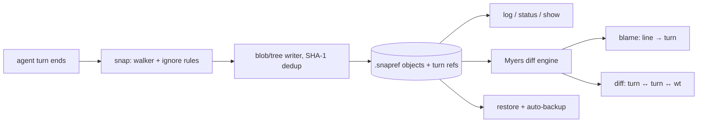

# snapref

[English](README.md) | [中文](README.zh.md) | [日本語](README.ja.md)

[](LICENSE) [](Cargo.toml)  [](CONTRIBUTING.md)

**Open-source shadow git snapshots for AI agent sessions — snapshot the working tree every turn, blame any line to the turn that wrote it, restore any state.**


```bash
git clone https://github.com/JaydenCJ/snapref.git && cargo install --path snapref
```

## Why snapref?

Forty turns into an agent session, "which turn broke this file?" has no good answer. Telemetry replayers reconstruct spans and tool calls, not the bytes on disk; committing after every turn works but floods your real git history with noise you must later squash away; IDE local history is per-file, per-editor, and cannot restore a whole tree state. snapref takes the git idea — content-addressed snapshots — and moves it into a shadow store (`.snapref/`) that never touches your repository. A wrapper calls `snapref snap` at the end of each agent turn; from then on `blame` names the turn behind every line, `diff` compares any two turns (or the working tree), and `restore` rewinds the entire tree — resurrecting deleted files, and backing up your uncommitted work as its own turn before it overwrites anything. It is a single std-only Rust binary: offline, deterministic, no telemetry.

|  | snapref | git commit per turn | IDE local history | telemetry replay |
|---|---|---|---|---|
| Tracks | working-tree bytes | staged content | editor buffers | spans / tool calls |
| Pollutes real git history | no (shadow store) | yes (noise commits) | no | no |
| Line → turn blame | yes | via git blame, noisy | no | no |
| Restores deletions + whole states | yes | yes | per file only | no (replays events) |
| Restore backs itself up first | yes (auto-backup turn) | manual stash | no | n/a |
| Works outside a git repo | yes | no | editor-bound | n/a |
| Dependencies | std-only binary | git + hook glue | an IDE | vendor SDKs |

<sub>Comparison as of 2026-07. snapref snapshots file states; it does not record prompts or tool calls — pair it with a telemetry tool if you also need those. Blob ids are computed exactly like git's, so snapshots are cross-checkable with `git hash-object`.</sub>

## Features

- **One snapshot per agent turn** — `snapref snap --label "fix parser" --agent my-agent` records the whole working tree in milliseconds; unchanged files deduplicate to zero extra bytes, and a turn where nothing changed is still recorded (that, too, is information).
- **Line → turn blame** — `snapref blame src/parser.rs` prints the turn, timestamp, and label behind every line; lines nobody has snapped yet show up as `wt (not snapped)`.
- **Restore that cannot lose work** — `snapref restore 12` rewinds the tree to turn 12, deletes files that turn did not have, resurrects ones it did — and first snaps your dirty tree as an automatic backup turn. Discarding work requires typing both `--no-backup` and `--force`.
- **git-native blob ids** — every file is stored under the exact id `git hash-object` would print, so any snapshot's contents can be verified against git itself.
- **A store you can audit** — `snapref verify` rehashes every object and walks every ref/tree/parent edge; a single flipped byte anywhere is named and fails the command.
- **Offline, deterministic, machine-readable** — no network calls ever, `SNAPREF_TIME` pins timestamps for reproducible runs, and `--json` on snap/log/status/blame/diff/show gives scripts a stable envelope.

## Quickstart

Install (requires Rust 1.75+; not yet on crates.io):

```bash
git clone https://github.com/JaydenCJ/snapref.git && cargo install --path snapref
```

Wire `snapref snap` into your agent loop (an end-of-turn hook, or the wrapper in [examples/](examples/)), then let a session run:

```bash
cd my-project && snapref init
# ... after each agent turn:
snapref snap --label "scaffold the parser" --agent demo-agent
```

Three turns later, ask what happened:

```bash
snapref log
```

Output (real, captured):

```text
turn 3  942d7ec3  2026-07-12T10:02:28Z  +0 ~1 -0  demo-agent: build the AST
turn 2  21f180ea  2026-07-12T10:01:13Z  +1 ~1 -0  demo-agent: add the lexer
turn 1  9b83bf13  2026-07-12T10:00:00Z  +2 ~0 -0  demo-agent: scaffold the parser
```

Blame any file down to the turn that wrote each line — including a stray edit no turn has snapped yet:

```bash
snapref blame src/parser.rs
```

```text
turn 1 | 2026-07-12T10:00:00Z | scaffold the parser | 1 | fn parse(input: &str) -> Ast {
turn 2 | 2026-07-12T10:01:13Z | add the lexer       | 2 |     let toks = lex(input);
wt     |                      | (not snapped)       | 3 |     dbg!(&toks);
turn 3 | 2026-07-12T10:02:28Z | build the AST       | 4 |     Ast::from_tokens(toks)
turn 1 | 2026-07-12T10:00:00Z | scaffold the parser | 5 | }
```

Turn 2 looks like where things went wrong? Rewind — your uncommitted `dbg!` line is snapped as turn 4 before a single byte is overwritten:

```bash
snapref restore 1
```

```text
working tree backed up as turn 4
restored working tree to turn 1 (9b83bf13): 1 file(s) written, 1 deleted
```

## Commands

| Command | Effect |
|---|---|
| `snapref init` | create the shadow store (`.snapref/`); idempotent |
| `snapref snap [--label L] [--agent A] [--turn N] [--json]` | record the working tree as the next turn |
| `snapref log [--limit N] [--json]` | list turns, newest first, with `+A ~M -D` file stats |
| `snapref status [--json]` | compare the working tree against the latest turn |
| `snapref blame PATH [--at TURN] [--json]` | attribute every line to the turn that wrote it |
| `snapref diff [FROM] [TO] [--path P] [--json]` | unified diff between turns, or against `wt` |
| `snapref show TURN` / `show TURN:PATH` | snapshot metadata + file list, or a file's exact bytes |
| `snapref restore TURN [--path P] [--no-backup] [--force]` | rewind the tree (or just some paths) to a turn |
| `snapref verify` | rehash every object, check every ref/tree/parent edge |

Exit codes: `0` success, `1` operational failure (unknown turn, dirty restore refused, corrupt store), `2` usage error. `SNAPREF_AGENT` sets the default `--agent`; `SNAPREF_TIME` (epoch seconds) pins the clock for reproducible snapshots.

## What gets snapshotted

Everything in the working tree, including dotfiles — with these exceptions: `.git` and `.snapref` are always skipped; heavy regenerable directories (`node_modules`, `target`, `__pycache__`, `.venv`, `venv`, `dist`, `.cache`, `.DS_Store`) are excluded by default; symlinks are never followed. A `.snaprefignore` file at the root adds gitignore-flavored patterns (`*.log`, `scratch/`, `gen/**` — negation is not supported in 0.1.0). The ignore file itself is tracked, so ignore rules travel with the history.

## The shadow store

`.snapref/` holds content-addressed objects (`blob`, `tree`, `snapshot`) plus one ref file per turn — the full format is specified in [docs/store-format.md](docs/store-format.md). Blobs are hashed over `blob <len>\0<bytes>`, byte-identical to git blob ids; trees and snapshot records use a line-oriented text encoding you can read with `cat`. Snapshots deduplicate: a 500-file tree where one file changed costs one blob, a handful of trees, and one snapshot record. Add `.snapref/` to your `.gitignore`.

## Architecture



## Roadmap

- [x] Core engine: per-turn snapshots with dedup, line→turn blame, unified diff, whole-tree restore with auto-backup, store verify, JSON output everywhere
- [ ] `snapref gc` — drop turns older than N, keeping every object still reachable
- [ ] Rename detection in blame and diff
- [ ] Negation patterns (`!keep.log`) in `.snaprefignore`
- [ ] `snapref export` — replay a turn range as real git commits onto a branch

See the [open issues](https://github.com/JaydenCJ/snapref/issues) for the full list.

## Contributing

Contributions are welcome — see [CONTRIBUTING.md](CONTRIBUTING.md), start with a [good first issue](https://github.com/JaydenCJ/snapref/issues?q=is%3Aissue+is%3Aopen+label%3A%22good+first+issue%22) or open a [discussion](https://github.com/JaydenCJ/snapref/discussions).

## License

[MIT](LICENSE)
