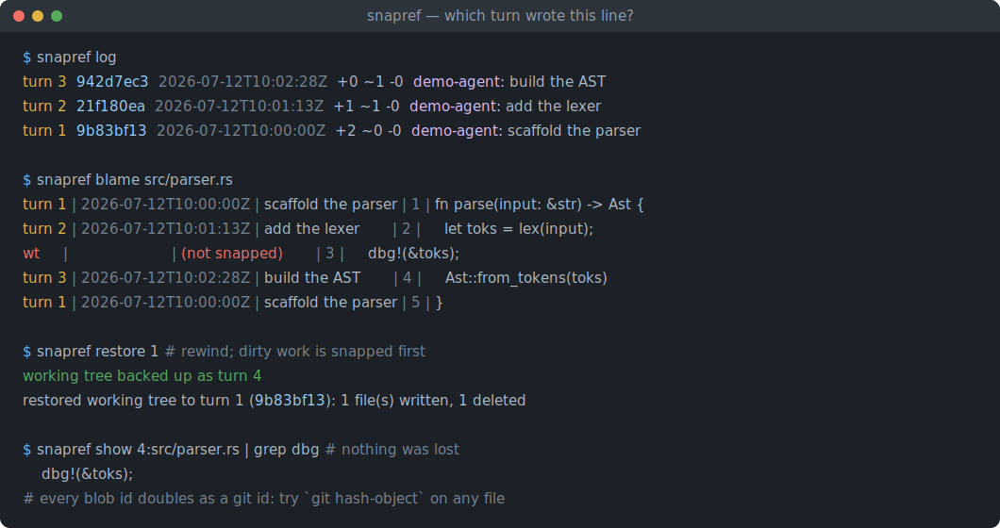
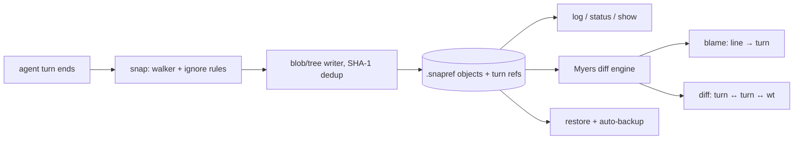

# snapref

[English](README.md) | [中文](README.zh.md) | [日本語](README.ja.md)

[](LICENSE) [](Cargo.toml)  [](CONTRIBUTING.md)

**开源的 AI agent 会话影子 git 快照工具——每个 turn 快照一次工作区，任意一行代码可以 blame 到写下它的 turn，任意状态可以还原。**



```bash
git clone https://github.com/JaydenCJ/snapref.git && cargo install --path snapref
```

## 为什么选 snapref？

agent 会话跑到第四十个 turn 之后，"这个文件是哪个 turn 弄坏的？"就没有好答案了。遥测回放工具重建的是 span 和工具调用，而不是磁盘上的字节；每个 turn 都 commit 一次可行，但会把真正的 git 历史淹没在事后必须 squash 掉的噪音里；IDE 的本地历史按文件、按编辑器隔离，无法还原整棵目录树的状态。snapref 把 git 的核心思想——内容寻址快照——搬进一个影子仓库（`.snapref/`），完全不碰你的真实仓库。用包装脚本在每个 agent turn 结束时调用 `snapref snap`；此后 `blame` 能说出每一行背后的 turn，`diff` 能比较任意两个 turn（或工作区），`restore` 能回退整棵树——被删的文件会复活，而且在覆盖任何字节之前，你未提交的改动会先被存成一个独立的备份 turn。它是单个只依赖 std 的 Rust 二进制：离线、确定性、无遥测。

|  | snapref | 每 turn 一次 git commit | IDE 本地历史 | 遥测回放 |
|---|---|---|---|---|
| 跟踪对象 | 工作区字节 | 暂存区内容 | 编辑器缓冲区 | span / 工具调用 |
| 污染真实 git 历史 | 否（影子仓库） | 是（噪音 commit） | 否 | 否 |
| 行 → turn blame | 支持 | 借助 git blame，噪音大 | 无 | 无 |
| 还原删除 + 整树状态 | 支持 | 支持 | 仅按文件 | 否（只回放事件） |
| 还原前先自我备份 | 支持（自动备份 turn） | 手动 stash | 无 | 不适用 |
| 无 git 仓库也能用 | 支持 | 不能 | 绑定编辑器 | 不适用 |
| 依赖 | 只有 std 的二进制 | git + hook 胶水 | 一个 IDE | 厂商 SDK |

<sub>对比截至 2026-07。snapref 快照的是文件状态，不记录 prompt 和工具调用——如果也需要那些，请搭配遥测工具使用。blob id 的计算方式与 git 完全一致，因此快照可以用 `git hash-object` 交叉验证。</sub>

## 功能

- **每个 agent turn 一个快照** — `snapref snap --label "fix parser" --agent my-agent` 毫秒级记录整个工作区；未变化的文件去重后零额外存储，就连什么都没改的 turn 也会被记录（这本身也是信息）。
- **行 → turn blame** — `snapref blame src/parser.rs` 打印每一行背后的 turn、时间戳和标签；还没被任何快照收录的行会显示为 `wt (not snapped)`。
- **不可能丢工作的 restore** — `snapref restore 12` 把树回退到 turn 12：那个 turn 没有的文件被删除，有的文件被复活——并且会先把你的脏工作区快照成一个自动备份 turn。想真正丢弃改动，必须同时敲下 `--no-backup` 和 `--force`。
- **git 原生 blob id** — 每个文件都以 `git hash-object` 会打印的那个 id 存储，任何快照的内容都能拿 git 本身来验证。
- **可审计的存储** — `snapref verify` 重新哈希每个对象并遍历每条 ref/tree/parent 边；任何位置翻转一个字节都会被点名并令命令失败。
- **离线、确定性、机器可读** — 永不联网，`SNAPREF_TIME` 固定时钟以获得可复现的快照，snap/log/status/blame/diff/show 都带 `--json`，给脚本一个稳定的信封格式。

## 快速上手

安装（需要 Rust 1.75+；尚未发布到 crates.io）：

```bash
git clone https://github.com/JaydenCJ/snapref.git && cargo install --path snapref
```

把 `snapref snap` 接进你的 agent 循环（turn 结束钩子，或 [examples/](examples/) 里的包装脚本），然后让会话跑起来：

```bash
cd my-project && snapref init
# ... after each agent turn:
snapref snap --label "scaffold the parser" --agent demo-agent
```

三个 turn 之后，问问发生了什么：

```bash
snapref log
```

输出（真实捕获）：

```text
turn 3  942d7ec3  2026-07-12T10:02:28Z  +0 ~1 -0  demo-agent: build the AST
turn 2  21f180ea  2026-07-12T10:01:13Z  +1 ~1 -0  demo-agent: add the lexer
turn 1  9b83bf13  2026-07-12T10:00:00Z  +2 ~0 -0  demo-agent: scaffold the parser
```

任意文件 blame 到写下每一行的 turn——包括尚未被任何 turn 快照的临时改动：

```bash
snapref blame src/parser.rs
```

```text
turn 1 | 2026-07-12T10:00:00Z | scaffold the parser | 1 | fn parse(input: &str) -> Ast {
turn 2 | 2026-07-12T10:01:13Z | add the lexer       | 2 |     let toks = lex(input);
wt     |                      | (not snapped)       | 3 |     dbg!(&toks);
turn 3 | 2026-07-12T10:02:28Z | build the AST       | 4 |     Ast::from_tokens(toks)
turn 1 | 2026-07-12T10:00:00Z | scaffold the parser | 5 | }
```

看起来 turn 2 就是出问题的地方？回退——在覆盖任何字节之前，你未提交的 `dbg!` 行已被快照成 turn 4：

```bash
snapref restore 1
```

```text
working tree backed up as turn 4
restored working tree to turn 1 (9b83bf13): 1 file(s) written, 1 deleted
```

## 命令

| 命令 | 作用 |
|---|---|
| `snapref init` | 创建影子仓库（`.snapref/`）；幂等 |
| `snapref snap [--label L] [--agent A] [--turn N] [--json]` | 把工作区记录为下一个 turn |
| `snapref log [--limit N] [--json]` | 列出各 turn（最新在前），附 `+A ~M -D` 文件统计 |
| `snapref status [--json]` | 比较工作区与最新 turn |
| `snapref blame PATH [--at TURN] [--json]` | 把每一行归因到写下它的 turn |
| `snapref diff [FROM] [TO] [--path P] [--json]` | turn 之间（或对 `wt`）的 unified diff |
| `snapref show TURN` / `show TURN:PATH` | 快照元数据 + 文件列表，或某文件的精确字节 |
| `snapref restore TURN [--path P] [--no-backup] [--force]` | 把树（或部分路径）回退到某个 turn |
| `snapref verify` | 重新哈希所有对象，检查所有 ref/tree/parent 边 |

退出码：`0` 成功，`1` 运行失败（未知 turn、脏树 restore 被拒、仓库损坏），`2` 用法错误。`SNAPREF_AGENT` 设定默认 `--agent`；`SNAPREF_TIME`（epoch 秒）固定时钟以获得可复现快照。

## 快照收录什么

工作区里的一切，包括点文件——例外如下：`.git` 和 `.snapref` 永远跳过；重型可再生目录（`node_modules`、`target`、`__pycache__`、`.venv`、`venv`、`dist`、`.cache`、`.DS_Store`）默认排除；符号链接永不跟随。根目录的 `.snaprefignore` 文件可追加 gitignore 风格的模式（`*.log`、`scratch/`、`gen/**`——0.1.0 不支持取反）。ignore 文件本身会被跟踪，因此忽略规则随历史一起流动。

## 影子仓库

`.snapref/` 存放内容寻址对象（`blob`、`tree`、`snapshot`）以及每个 turn 一个的 ref 文件——完整格式见 [docs/store-format.md](docs/store-format.md)。blob 按 `blob <len>\0<bytes>` 哈希，与 git blob id 逐字节相同；tree 和 snapshot 记录采用 `cat` 就能读的行式文本编码。快照会去重：500 个文件里只改了一个时，代价只是一个 blob、几个 tree 和一条 snapshot 记录。记得把 `.snapref/` 加进 `.gitignore`。

## 架构



## 路线图

- [x] 核心引擎：带去重的每 turn 快照、行→turn blame、unified diff、带自动备份的整树 restore、仓库校验、全命令 JSON 输出
- [ ] `snapref gc` —— 丢弃 N 个以前的 turn，保留仍可达的所有对象
- [ ] blame 与 diff 的重命名检测
- [ ] `.snaprefignore` 的取反模式（`!keep.log`）
- [ ] `snapref export` —— 把一段 turn 区间回放成某分支上的真实 git commit

完整列表见 [open issues](https://github.com/JaydenCJ/snapref/issues)。

## 贡献

欢迎贡献——请看 [CONTRIBUTING.md](CONTRIBUTING.md)，可以从 [good first issue](https://github.com/JaydenCJ/snapref/issues?q=is%3Aissue+is%3Aopen+label%3A%22good+first+issue%22) 入手，或发起一个 [discussion](https://github.com/JaydenCJ/snapref/discussions)。

## 许可证

[MIT](LICENSE)
